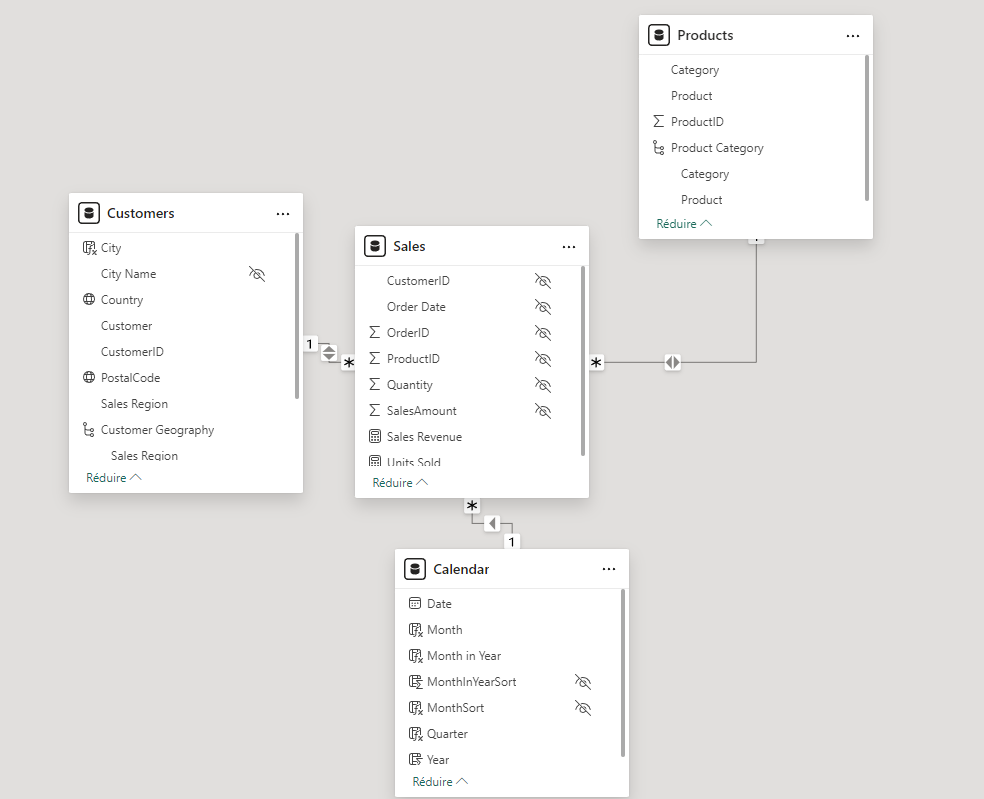
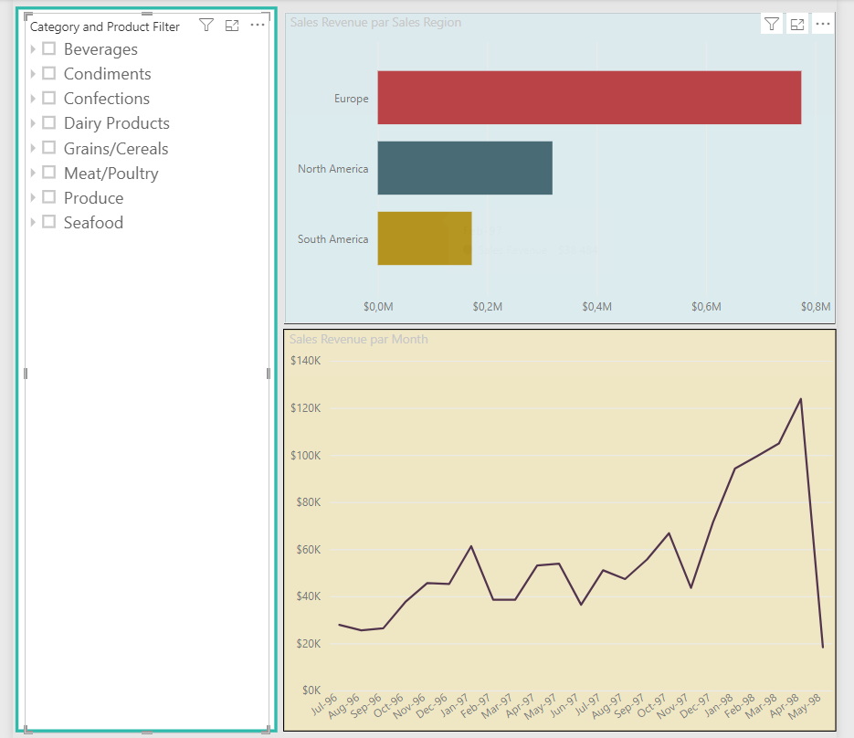

# PROJET PBI XYZ

## Table de matière

- [PROJET PBI XYZ](#projet-pbi-xyz)
  - [Table de matière](#table-de-matière)
  - [Introduction](#introduction)
  - [Modèle Tabulaires](#modèle-tabulaires)
  - [PBI](#pbi)
    - [Visuelle 1](#visuelle-1)
    - [Visuelle 2](#visuelle-2)
    - [Animation](#animation)
  - [Conclusion](#conclusion)

## Introduction

Ceci est un Projet PBI 

## Modèle Tabulaires

## PBI
Voici quelques Visuel  avec EXCEL
### Visuelle 1

### Visuelle 2

### Animation 

## Conclusion
Le but de Projet et ........

